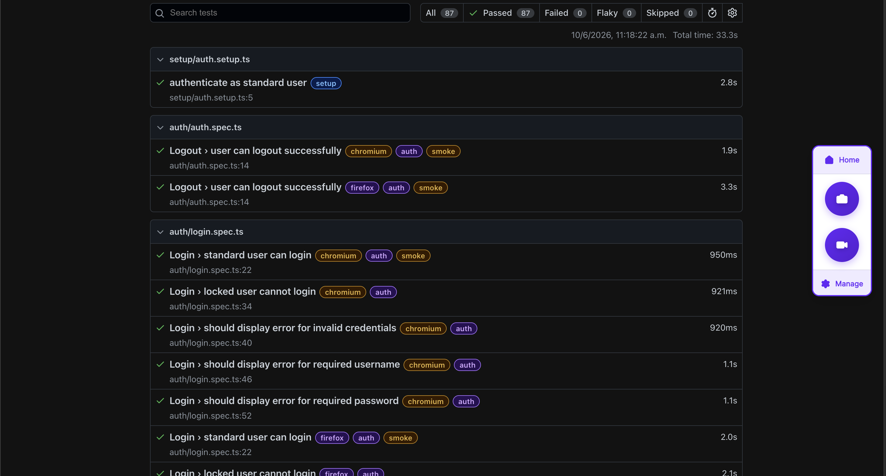

# Playwright Automation Framework


Enterprise-style QA Automation framework built with Playwright and TypeScript.

## Contents

- [Overview](#overview)
- [Tech Stack](#tech-stack)
- [Project Structure](#project-structure)
- [Current Test Coverage](#current-test-coverage)
- [Architecture Highlights](#architecture-highlights)
- [Design Principles](#design-principles)
- [Running Tests](#running-tests)
- [Reporting](#reporting)
- [Future Improvements](#future-improvements)
- [Author](#author)

---

# Overview

This project was designed to simulate a real-world enterprise automation framework using:

- Page Object Model (POM)
- Reusable architecture
- BasePage abstraction
- Centralized constants and fixtures
- Clean assertions
- Stable synchronization strategies
- Positive and negative test scenarios
- Cross-browser execution (Chromium and Firefox)

The goal is not only to automate tests, but also to demonstrate framework design, maintainability, and QA Automation engineering practices.

---

# Tech Stack

- Playwright Test Runner
- TypeScript (strict mode)
- Node.js
- GitHub Actions

---

# Project Structure

```txt
src/
├── core/
│   ├── constants/
│   ├── fixtures/
│   ├── helpers/
│   └── utils/
│
├── ui/
│   ├── components/
│       └── baseComponent/
│   └── pages/
│       └── basePage/
│
tests/
├── auth/
├── inventory/
├── item/
├── cart/
├── checkout/
│
├── fixtures/
│   └── pages.ts
│
└── setup/
    └── auth.setup.ts
```

---

# Current Test Coverage

## Authentication

- Successful login
- Invalid credentials
- Locked user validation
- Required username validation
- Required password validation
- Logout flow

## Inventory

- Inventory page validation
- Product sorting
- Add/remove products to cart
- Multiple cart selections
- Product card validations
- Navigation to item details

## Item Details

- Item details page validation
- Navigation from inventory cards
- Add/remove products to cart from item details
- Navigation back to inventory

## Cart

- Empty cart validation
- Single item cart validation
- Multiple items cart validation
- Remove products from cart
- Continue shopping navigation
- Cart state preservation after item removal

## Checkout

- Checkout Step One validation
- Required field validations
- Error message validations
- Checkout information submission
- Checkout Step Two validation
- Order summary validation
- Item quantity validation
- Total calculation validation
- Checkout cancellation flow
- Checkout completion flow
- Return to inventory after order completion

---

# Architecture Highlights

## Page Object Model (POM)

UI interactions are encapsulated into reusable page objects to improve readability and maintainability.

---

## Reusable UI Components

The framework models UI using domain-driven components:

- InventoryCardComponent represents a product in the inventory
- InventoryContainerComponent manages collections of inventory cards

- CartItemComponent represents a product inside the shopping cart
- CartContainerComponent manages collections of cart items

- CheckoutItemComponent represents a product in the checkout overview
- CheckoutContainerComponent manages collections of checkout items

---

## Shared Component Architecture

Reusable UI entities are modeled through shared abstractions.

Examples:

- BaseItemComponent
  - InventoryCardComponent
  - CartItemComponent
  - CheckoutItemComponent

This approach centralizes common product behavior while allowing each business context to expose its own actions and validations.

---

## Collection Management Pattern

Container components are responsible for managing collections of UI entities.

Examples:

- InventoryContainerComponent manages product cards
- CartContainerComponent manages cart items

Entity-specific behavior remains encapsulated within the corresponding component.

---

## BasePage Abstraction

Common behaviors and reusable assertions are centralized in a shared `BasePage`.

---

## Reusable Assertions

Custom reusable validations were implemented to avoid duplicated logic and improve test clarity.

---

## Centralized Test Data

Constants, routes, UI texts, and fixtures are separated from test logic to improve scalability and maintenance.

---

## Reliable Synchronization Strategy

`Promise.all()` is used for navigation synchronization in order to prevent flaky tests and race conditions during page transitions.

Example:

```ts
await Promise.all([
  page.waitForURL(new RegExp(ROUTES.INVENTORY)),
  loginPage.login(USERS.STANDARD.username, USERS.STANDARD.password),
]);
```

---

## Storage State Authentication

Authentication is handled using Playwright Storage State.

A dedicated setup project performs the login once and stores the authenticated session, allowing tests to start already authenticated without repeating UI login steps.

This reduces execution time and keeps tests focused on business scenarios instead of authentication flows.

---

## Custom Playwright Fixtures

Custom fixtures are used to provide page objects already initialized and ready to use.

This keeps tests concise, reduces setup duplication, and improves readability.

Example:

```ts
test('user can add product to cart', async ({ inventoryPage }) => {
  const backpackItem =
    inventoryPage.inventoryContainer.getCard(
      'Sauce Labs Backpack'
    );

  await backpackItem.addToCart();
});
```

---

## Domain-Oriented Component Architecture

The framework follows a domain-oriented component model:

Page
 └── Container
      └── Entity Component

Examples:

InventoryPage
 └── InventoryContainerComponent
      └── InventoryCardComponent

CartPage
 └── CartContainerComponent
      └── CartItemComponent

CheckoutStepTwoPage
 └── CheckoutContainerComponent
      └── CheckoutItemComponent

This structure promotes scalability, separation of responsibilities, and reusable business abstractions.

---

# Design Principles

- Composition over duplication
- Encapsulation of UI behavior through Page Objects and Components
- Card-based UI modeling for domain clarity
- Container as collection manager (not data service)
- Stable selectors using data-test attributes
- Clear separation between test logic, page objects, and UI components
- Reusable assertions and test utilities
- Type-safe test APIs with TypeScript
- Authentication isolated from business scenarios using Storage State
- Maintainable and scalable test architecture
- Shared abstractions through BaseItemComponent
- Domain-oriented UI modeling
- Clear separation between page, container, and entity responsibilities

---

## Extensible Architecture

The framework is organized to support both UI and API automation layers.

While the current implementation focuses on UI testing, the framework has been designed to support a future API layer through reusable clients, endpoint abstractions, and hybrid UI/API testing strategies when working with applications that expose testable APIs.

---

## Test Tagging Strategy

The framework uses Playwright metadata tags to organize execution by business domain and test criticality.

Examples:

- @smoke
- @auth
- @inventory
- @item-details
- @cart
- @checkout

---

# Example Test Flow

```ts
const backpackItem = inventoryPage.inventoryContainer.getCard("Sauce Labs Backpack");

await backpackItem.addToCart();

await inventoryPage.header.assertCartBadgeCount(1);
```

Tests interact with reusable page and component APIs instead of raw selectors, improving readability and maintainability.

---

# Running Tests

## Run all tests

```bash
npx playwright test
```

---

## Run smoke tests

```bash
npx playwright test --grep @smoke
```

---

## Run specific file

```bash
npx playwright test tests/smoke/login.spec.ts
```

---

## Run in UI mode

```bash
npx playwright test --ui
```

---

## Run headed browser

```bash
npx playwright test --headed
```

---

# Reporting

The framework uses Playwright's built-in reporting capabilities to provide detailed execution results and debugging artifacts.

Available features:

- Interactive HTML reports
- Failure screenshots
- Failure videos
- Execution traces on retries

Configuration:

```ts
reporter: [["html"], ["list"]]

trace: "on-first-retry"
screenshot: "only-on-failure"
video: "retain-on-failure"
```

Generate and open the report:

```bash
npx playwright test
npx playwright show-report
```

Failure artifacts are automatically preserved, enabling faster debugging and root cause analysis.

## Sample Report

The framework generates interactive HTML reports that provide execution results, test metadata, tags, timings, and debugging artifacts.



---

# Docker Support

The framework can be executed inside a Docker container using the official Playwright image.

Build image:

```bash
docker build -t playwright-demo .
```

Run tests:
docker run --rm playwright-demo

---

# Visual Regression Testing

The framework includes visual regression testing using Playwright snapshot assertions.

Current visual coverage:

- Login Page
- Inventory Page
- Item Details Page
- Cart Page
- Checkout Step One
- Checkout Step Two
- Checkout Complete

Visual tests are executed in both Chromium and Firefox and compare the current UI against approved baseline snapshots to detect unexpected visual changes.

---

# Current Framework Status

Current implementation includes:

- Authentication workflow
- Inventory workflow
- Item Details workflow
- Cart workflow
- Complete Checkout workflow
- Shared page and component abstractions
- Storage State authentication
- Cross-browser execution
- Smoke and functional test suites

Current test suite: 87+ automated tests

---

# Author

QA Automation portfolio project focused on scalable test architecture, maintainable automation design, and modern Playwright engineering practices.
